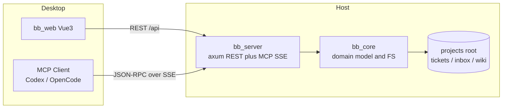

# 架构总览

这张图展示 bb_server、bb_core、bb_web、MCP 客户端之间的运行时关系：

```mermaid
flowchart LR
  subgraph Desktop
    UI[bb_web Vue3]
    MCPClient[MCP Client<br/>Codex / OpenCode]


  subgraph Host
    Server[bb_server<br/>axum REST plus MCP SSE]
    Core[bb_core<br/>domain model and FS]
    FS[(projects root<br/>tickets / inbox / wiki)]
  end

  UI -- REST /api --> Server
  MCPClient -- JSON-RPC over SSE --> Server
  Server --> Core
  Core --> FS
```



```cpp
int main()
{
  cout << "Hello Blackboard!\n";
}
```

- `bb_core` 负责 ticket / inbox / wiki 的文件 CRUD 与路径安全校验。
- `bb_server` 只做薄包装：REST 对 UI，MCP 对外部 Agent。
- `bb_web` 以 `fetch` 直连 REST。

回到 [入口](../index.md)。
