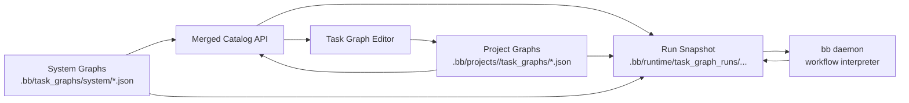
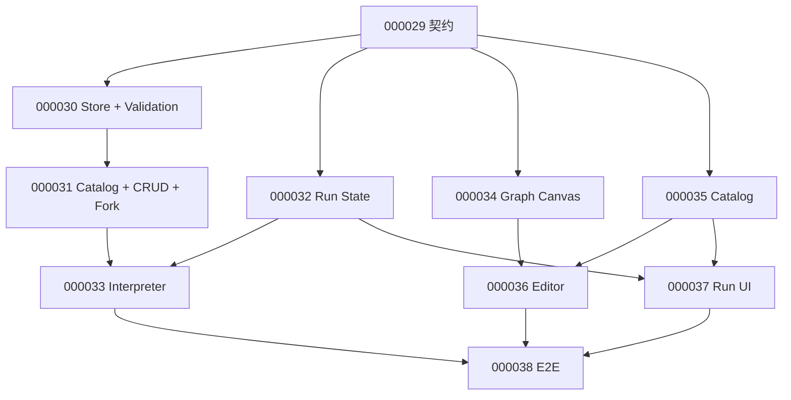

# Task Graph MVP 前后端契约

来源 ticket：`000029`  

## 交付目标

本文定义 Task Graph MVP 的共同契约，使后端可以独立实现存储、API、运行态与 daemon executor，前端可以独立实现 catalog、editor、inspector 与 run UI。

MVP 的核心闭环是：

1. 用户在某个 project 看到 BB 内置 system graph 与 project graph。
2. 用户可直接运行 system graph。
3. 用户编辑 system graph 时必须先 fork/customize 到当前 project。
4. 用户可创建、编辑、保存 project graph。
5. daemon 可执行包含 LLM、registered task、Branch、Loop、Human Gate 的 workflow。
6. 每次运行都生成冻结 snapshot，历史 run 不受 graph 后续编辑或 system graph 升级影响。

## 非目标

- 不在 MVP 中实现任意数据流映射 UI。
- 不在 MVP 中支持跨 project graph 引用。
- 不把 Task Graph 的控制流写入 ticket `depends_on`。
- 不允许用户画无法解释的任意环。
- 不把 system graph 复制到每个 project；只有 customize/fork 时才生成 project graph。

## 语义边界

Task Graph 是受约束的 Control Flow Graph，不是纯 DAG。

Ticket Graph 表示工作依赖关系，来源是 ticket frontmatter 的 `depends_on` / `dependencies`。Task Graph 表示执行编排关系，来源是 Task Graph definition 的 `nodes` / `edges`。两者可以互相引用，但语义不共享。



## 存储位置

### System Graphs

BB 内置 graph 放在 repo 级目录：

```text
.bb/task_graphs/system/<graph-id>.json
```

约束：

- `scope = "system"`
- 只读
- 随 Blackboard 版本发布和升级
- 对所有 project 可见
- 可直接运行
- 可 fork/customize 到当前 project

### Project Graphs

用户项目内 graph 放在：

```text
.bb/projects/<project>/task_graphs/<graph-id>.json
```

约束：

- `scope = "project"`
- 可编辑
- 只属于当前 project
- 可以从空白创建
- 可以由 system graph fork/customize 生成

### Run State

每次运行放在：

```text
.bb/runtime/task_graph_runs/<project>/<run-id>/
  run.json
  graph.snapshot.json
  nodes/<node-id>.json
  logs/<node-id>.log
  artifacts/<artifact-id>.md
  artifacts/<artifact-id>.json
```

约束：

- `graph.snapshot.json` 是本次运行的冻结图。
- run detail 读取 snapshot，而不是读取最新 graph definition。
- system graph 后续升级不改变历史 run。
- project graph 后续编辑不改变历史 run。

## 标识规范

### Graph ID

Graph id 使用 kebab-case：

```text
^[a-z][a-z0-9-]{1,63}$
```

示例：

- `frontend-smoke-loop`
- `release-check`
- `inbox-cleanup-pipeline`

### Node ID

Node id 使用 kebab-case，并建议带类型前缀：

```text
start
plan-llm
smoke-task
failure-branch
fix-loop
human-approval
end-success
```

### Edge ID

Edge id 使用 `<from>__<to>` 或带出口语义：

```text
start__plan-llm
failure-branch__fix-loop__has-failures
fix-loop__smoke-task__body
smoke-task__fix-loop__return
```

## Graph Reference

前后端传递 graph 引用时必须显式带 scope：

```json
{
  "scope": "system",
  "id": "frontend-smoke-loop"
}
```

```json
{
  "scope": "project",
  "id": "release-check"
}
```

`list_projects` 之外所有 API 都必须显式带 project。

## Graph Definition

Graph definition 是 system graph 和 project graph 共用的数据结构。

```ts
type TaskGraphDefinition = {
  schema_version: 1
  id: string
  scope: "system" | "project"
  title: string
  description?: string
  version: number
  readonly: boolean
  origin?: GraphOrigin
  metadata?: GraphMetadata
  nodes: TaskGraphNode[]
  edges: TaskGraphEdge[]
  layout?: TaskGraphLayout
}
```

### Origin

Project graph 如果来自 system graph fork，必须记录 origin：

```json
{
  "scope": "system",
  "id": "frontend-smoke-loop",
  "version": 1,
  "forked_at": "2026-05-09T00:00:00Z"
}
```

### Metadata

```ts
type GraphMetadata = {
  tags?: string[]
  related_tickets?: string[]
  owner?: string
  created_by?: string
  updated_by?: string
}
```

`related_tickets` 使用六位 ticket id 字符串，例如 `["000028", "000029"]`。

## Node Model

```ts
type TaskGraphNode = {
  id: string
  type:
    | "start"
    | "end"
    | "llm"
    | "registered_task"
    | "human_gate"
    | "branch"
    | "loop"
  label: string
  description?: string
  position?: { x: number; y: number }
  config: NodeConfig
}
```

### Start Node

每张 graph 必须有且只能有一个 `start` node。

```json
{
  "id": "start",
  "type": "start",
  "label": "Start",
  "position": { "x": 80, "y": 120 },
  "config": {}
}
```

约束：

- 无 incoming control edge。
- 至少一个 outgoing control edge。

### End Node

每张 graph 至少有一个 `end` node。

```json
{
  "id": "end-success",
  "type": "end",
  "label": "Success",
  "position": { "x": 1580, "y": 120 },
  "config": {
    "result": "succeeded"
  }
}
```

约束：

- 无 outgoing control edge。
- `result` 为 `succeeded`、`failed` 或 `cancelled`。

### LLM Node

```json
{
  "id": "plan-llm",
  "type": "llm",
  "label": "生成检查计划",
  "position": { "x": 320, "y": 120 },
  "config": {
    "runtime": "codex",
    "agent": "codex",
    "model": null,
    "prompt": {
      "mode": "inline",
      "template": "请基于 {project} 生成前端冒烟检查计划，并输出 JSON。"
    },
    "inputs": {
      "include_project": true,
      "include_upstream_outputs": true,
      "ticket_refs": ["000028", "000029"]
    },
    "output": {
      "artifact_type": "json",
      "required": true
    }
  }
}
```

约束：

- `runtime` MVP 支持 `codex`、`codex-interactive`、`opencode`、`claude`。
- `agent` 必须存在于 agent registry，或为 `native`。
- `prompt.mode = "inline"` 是 MVP 必选；`file` 可后续扩展。
- 如果 `artifact_type = "json"`，executor 应尽量解析并写入 JSON artifact；解析失败时 node failed。

### Registered Task Node

```json
{
  "id": "smoke-task",
  "type": "registered_task",
  "label": "运行前端冒烟",
  "position": { "x": 560, "y": 120 },
  "config": {
    "task_id": "frontend-smoke-test",
    "agent_override": null,
    "model_override": null,
    "prompt_vars": {
      "project": "{project}"
    },
    "output": {
      "artifact_type": "markdown",
      "required": true
    }
  }
}
```

约束：

- `task_id` 必须存在于 `agents/tasks.toml`。
- 默认使用 task registry 中的 runtime 和 agent。
- override 字段 MVP 可以先只透传到 executor，不要求 UI 完整支持。

### Human Gate Node

```json
{
  "id": "human-approval",
  "type": "human_gate",
  "label": "人工确认是否修复",
  "position": { "x": 1040, "y": 300 },
  "config": {
    "title": "是否允许自动修复前端问题",
    "instructions": "请查看前序 LLM 修复建议后选择继续或终止。",
    "actions": [
      { "id": "resume", "label": "继续", "result": "resume" },
      { "id": "reject", "label": "终止", "result": "cancel" }
    ]
  }
}
```

约束：

- executor 执行到 `human_gate` 时 run 状态变为 `paused`。
- MVP 必须能展示 paused 原因。
- Resume/Reject API 可以在 Run UI 第一版中显示占位，但契约必须预留。

### Branch Node

Branch 是 deterministic control-flow node。MVP 不让 Branch 自己调用 LLM 判断；LLM 应在上游输出结构化 JSON，Branch 只读 run context。

```json
{
  "id": "failure-branch",
  "type": "branch",
  "label": "是否有失败",
  "position": { "x": 800, "y": 120 },
  "config": {
    "mode": "first_match",
    "input_ref": "$.nodes.smoke-task.output",
    "rules": [
      {
        "id": "has-failures",
        "label": "有失败",
        "when": {
          "path": "$.failures.length",
          "op": ">",
          "value": 0
        }
      },
      {
        "id": "clean",
        "label": "无失败",
        "when": {
          "op": "always"
        }
      }
    ],
    "default_rule_id": "clean"
  }
}
```

约束：

- MVP 支持 `mode = "first_match"`。
- `rules[].id` 必须有对应 outgoing edge：`source_handle = "rule:<rule-id>"`。
- `default_rule_id` 必须存在于 rules。
- condition path 使用 JSONPath 子集，MVP 只支持 `$`、`.`、数组长度 `.length`。
- 支持 op：`always`、`exists`、`equals`、`not_equals`、`>`、`>=`、`<`、`<=`、`contains`、`is_empty`、`not_empty`、`truthy`、`falsy`。

### Loop Node

Loop 是唯一允许受控回边的节点。不要允许用户通过普通边画任意环。

```json
{
  "id": "fix-loop",
  "type": "loop",
  "label": "最多重试三次",
  "position": { "x": 1280, "y": 300 },
  "config": {
    "max_iterations": 3,
    "condition": {
      "input_ref": "$.nodes.smoke-task.output",
      "path": "$.failures.length",
      "op": ">",
      "value": 0
    },
    "body_entry": "fix-llm",
    "body_exit": "smoke-task",
    "on_max_iterations": "fail"
  }
}
```

约束：

- `max_iterations` 必填，MVP 建议 UI 限制 1 到 10，后端硬限制 1 到 50。
- Loop node 必须有 `source_handle = "body"` 的 outgoing edge。
- Loop node 必须有 `source_handle = "exit"` 的 outgoing edge。
- `body_exit` 必须能通过 `target_handle = "return"` 回到 Loop node。
- 只有 Loop 的 return edge 允许形成 cycle。
- executor 必须记录每一轮 iteration 和退出原因。

退出原因：

```text
condition_false
max_iterations_reached
node_failed
manual_cancelled
```

## Edge Model

MVP 只实现 control edge。后续 data edge 可以单独扩展。

```ts
type TaskGraphEdge = {
  id: string
  from: string
  to: string
  kind: "control"
  label?: string
  source_handle?: string
  target_handle?: string
}
```

普通顺序边：

```json
{
  "id": "plan-llm__smoke-task",
  "from": "plan-llm",
  "to": "smoke-task",
  "kind": "control"
}
```

Branch 出口边：

```json
{
  "id": "failure-branch__fix-loop__has-failures",
  "from": "failure-branch",
  "to": "fix-loop",
  "kind": "control",
  "label": "有失败",
  "source_handle": "rule:has-failures"
}
```

Loop body / exit / return 边：

```json
{
  "id": "fix-loop__fix-llm__body",
  "from": "fix-loop",
  "to": "fix-llm",
  "kind": "control",
  "label": "重试",
  "source_handle": "body"
}
```

```json
{
  "id": "smoke-task__fix-loop__return",
  "from": "smoke-task",
  "to": "fix-loop",
  "kind": "control",
  "target_handle": "return"
}
```

```json
{
  "id": "fix-loop__end-failed__exit",
  "from": "fix-loop",
  "to": "end-failed",
  "kind": "control",
  "label": "达到上限",
  "source_handle": "exit"
}
```

## Control Flow 校验

后端必须做最终校验。前端可以做即时提示，但不能替代后端校验。

必检规则：

1. graph exactly one start node。
2. graph at least one end node。
3. 所有 edge 的 from/to 节点存在。
4. start 无 incoming edge。
5. end 无 outgoing edge。
6. branch 的每个 rule 有且仅有一条匹配 outgoing edge。
7. branch 的 default_rule_id 存在。
8. loop 有 max_iterations。
9. loop 有 body edge、exit edge 和 return edge。
10. 任何 cycle 都必须经过 loop node，且 cycle 的回边必须指向 loop node 的 `target_handle = "return"`。
11. registered_task.task_id 存在于 `agents/tasks.toml`。
12. llm.runtime 为已知 runtime。
13. project graph 才能写入；system graph patch 必须拒绝。

## Catalog API

### List Graphs

```http
GET /api/projects/{project}/task-graphs
```

Response:

```json
{
  "graphs": [
    {
      "scope": "system",
      "id": "frontend-smoke-loop",
      "title": "前端冒烟修复循环",
      "description": "运行前端冒烟，失败时生成建议并经人工确认后重试。",
      "version": 1,
      "readonly": true,
      "source": "builtin",
      "origin": null,
      "node_count": 8,
      "edge_count": 9,
      "updated_at": "2026-05-09T00:00:00Z",
      "last_run": null
    },
    {
      "scope": "project",
      "id": "release-check",
      "title": "项目发布检查",
      "description": "用户 fork 后编辑的发布检查流程。",
      "version": 2,
      "readonly": false,
      "source": "project",
      "origin": {
        "scope": "system",
        "id": "frontend-smoke-loop",
        "version": 1,
        "forked_at": "2026-05-09T00:00:00Z"
      },
      "node_count": 9,
      "edge_count": 10,
      "updated_at": "2026-05-09T01:00:00Z",
      "last_run": {
        "run_id": "run-20260509-010000",
        "status": "succeeded",
        "updated_at": "2026-05-09T01:05:00Z"
      }
    }
  ]
}
```

## Graph API

### Read Graph

```http
GET /api/projects/{project}/task-graphs/{scope}/{graph_id}
```

Response:

```json
{
  "graph": "<TaskGraphDefinition>"
}
```

`scope` 取值：`system` 或 `project`。

### Create Project Graph

```http
POST /api/projects/{project}/task-graphs
```

Body:

```json
{
  "graph": "<TaskGraphDefinition with scope=project>"
}
```

Response:

```json
{
  "graph": "<TaskGraphDefinition>",
  "validation": {
    "status": "passed",
    "errors": []
  }
}
```

### Patch Project Graph

```http
PATCH /api/projects/{project}/task-graphs/project/{graph_id}
```

Body:

```json
{
  "graph": "<TaskGraphDefinition with scope=project>",
  "expected_version": 2
}
```

Response increments version:

```json
{
  "graph": "<TaskGraphDefinition with version=3>",
  "validation": {
    "status": "passed",
    "errors": []
  }
}
```

### Fork System Graph

```http
POST /api/projects/{project}/task-graphs/system/{graph_id}/fork
```

Body:

```json
{
  "target_id": "frontend-smoke-custom",
  "title": "前端冒烟修复循环（项目自定义）"
}
```

Response:

```json
{
  "graph": "<TaskGraphDefinition with scope=project and origin>"
}
```

## Run API

### Create Run

```http
POST /api/projects/{project}/task-graph-runs
```

Body:

```json
{
  "graph": {
    "scope": "system",
    "id": "frontend-smoke-loop"
  },
  "input": {
    "ticket_refs": ["000028", "000029"]
  },
  "dry_run": false
}
```

Response:

```json
{
  "run": {
    "id": "run-20260509-010000",
    "project": "blackboard",
    "graph": {
      "scope": "system",
      "id": "frontend-smoke-loop",
      "version": 1
    },
    "status": "pending",
    "created_at": "2026-05-09T01:00:00Z",
    "updated_at": "2026-05-09T01:00:00Z"
  }
}
```

### Read Run

```http
GET /api/projects/{project}/task-graph-runs/{run_id}
```

Response:

```json
{
  "run": "<TaskGraphRunDetail>"
}
```

### Resume Human Gate

```http
POST /api/projects/{project}/task-graph-runs/{run_id}/gates/{node_id}/resume
```

Body:

```json
{
  "action": "resume",
  "comment": "同意自动修复并继续运行。"
}
```

Response:

```json
{
  "run_id": "run-20260509-010000",
  "status": "running"
}
```

### Cancel Run

```http
POST /api/projects/{project}/task-graph-runs/{run_id}/cancel
```

Response:

```json
{
  "run_id": "run-20260509-010000",
  "status": "cancelled"
}
```

## Run Detail Model

```ts
type TaskGraphRunDetail = {
  id: string
  project: string
  graph_ref: { scope: "system" | "project"; id: string; version: number }
  status:
    | "pending"
    | "running"
    | "paused"
    | "succeeded"
    | "failed"
    | "cancelled"
  created_at: string
  started_at?: string
  updated_at: string
  completed_at?: string
  paused?: {
    node_id: string
    reason: string
    actions: { id: string; label: string; result: string }[]
  }
  cursor: string[]
  context: RunContext
  graph_snapshot: TaskGraphDefinition
  nodes: TaskGraphRunNode[]
}
```

Node state:

```ts
type TaskGraphRunNode = {
  node_id: string
  status:
    | "idle"
    | "queued"
    | "running"
    | "succeeded"
    | "failed"
    | "skipped"
    | "paused"
  started_at?: string
  completed_at?: string
  duration_ms?: number
  iteration?: number
  exit_code?: number
  error?: {
    code: string
    message: string
  }
  output_artifact?: {
    id: string
    path: string
    content_type: "markdown" | "json" | "text"
  }
  log_tail?: string
}
```

Run context:

```ts
type RunContext = {
  input: Record<string, unknown>
  node_outputs: Record<string, unknown>
  branch_decisions: {
    node_id: string
    selected_rule_id: string
    selected_edge_id: string
    evaluated_at: string
  }[]
  loop_iterations: {
    loop_node_id: string
    current_iteration: number
    max_iterations: number
    exit_reason?: string
    history: {
      iteration: number
      started_at: string
      completed_at?: string
      result: "continued" | "exited" | "failed"
    }[]
  }[]
}
```

## Error Model

所有错误使用统一结构：

```json
{
  "error": {
    "code": "validation_failed",
    "message": "Task graph validation failed.",
    "details": [
      {
        "path": "nodes[3].config.max_iterations",
        "code": "required",
        "message": "Loop node requires max_iterations."
      }
    ]
  }
}
```

MVP 错误码：

| Code | HTTP | 含义 |
| --- | ---: | --- |
| `graph_not_found` | 404 | graph 不存在 |
| `run_not_found` | 404 | run 不存在 |
| `readonly_graph` | 403 | 尝试写 system graph |
| `validation_failed` | 400 | graph definition 校验失败 |
| `stale_version` | 409 | patch 的 expected_version 过旧 |
| `duplicate_graph_id` | 409 | project graph id 冲突 |
| `invalid_scope` | 400 | scope 不是 system/project |
| `task_not_found` | 400 | registered task 不存在 |
| `runtime_not_found` | 400 | LLM runtime 不支持 |
| `run_not_resumable` | 409 | run 不在 paused 或 gate 不匹配 |

## System Graph 示例

```json
{
  "schema_version": 1,
  "id": "frontend-smoke-loop",
  "scope": "system",
  "title": "前端冒烟修复循环",
  "description": "运行前端冒烟，失败时生成建议，经人工确认后最多重试三次。",
  "version": 1,
  "readonly": true,
  "metadata": {
    "tags": ["frontend", "smoke", "task-graph"],
    "related_tickets": ["000028", "000029"],
    "owner": "blackboard"
  },
  "nodes": [
    {
      "id": "start",
      "type": "start",
      "label": "Start",
      "position": { "x": 80, "y": 120 },
      "config": {}
    },
    {
      "id": "plan-llm",
      "type": "llm",
      "label": "生成检查计划",
      "position": { "x": 320, "y": 120 },
      "config": {
        "runtime": "codex",
        "agent": "codex",
        "model": null,
        "prompt": {
          "mode": "inline",
          "template": "为 {project} 生成前端冒烟检查计划，输出 JSON。"
        },
        "inputs": {
          "include_project": true,
          "include_upstream_outputs": true,
          "ticket_refs": ["000028", "000029"]
        },
        "output": {
          "artifact_type": "json",
          "required": true
        }
      }
    },
    {
      "id": "smoke-task",
      "type": "registered_task",
      "label": "运行前端冒烟",
      "position": { "x": 560, "y": 120 },
      "config": {
        "task_id": "frontend-smoke-test",
        "agent_override": null,
        "model_override": null,
        "prompt_vars": {
          "project": "{project}"
        },
        "output": {
          "artifact_type": "json",
          "required": true
        }
      }
    },
    {
      "id": "failure-branch",
      "type": "branch",
      "label": "是否有失败",
      "position": { "x": 800, "y": 120 },
      "config": {
        "mode": "first_match",
        "input_ref": "$.nodes.smoke-task.output",
        "rules": [
          {
            "id": "has-failures",
            "label": "有失败",
            "when": {
              "path": "$.failures.length",
              "op": ">",
              "value": 0
            }
          },
          {
            "id": "clean",
            "label": "无失败",
            "when": {
              "op": "always"
            }
          }
        ],
        "default_rule_id": "clean"
      }
    },
    {
      "id": "fix-llm",
      "type": "llm",
      "label": "生成修复建议",
      "position": { "x": 1040, "y": 300 },
      "config": {
        "runtime": "codex",
        "agent": "codex",
        "model": null,
        "prompt": {
          "mode": "inline",
          "template": "根据前端冒烟失败结果生成最小修复建议，输出 Markdown。"
        },
        "inputs": {
          "include_project": true,
          "include_upstream_outputs": true,
          "ticket_refs": ["000028", "000029"]
        },
        "output": {
          "artifact_type": "markdown",
          "required": true
        }
      }
    },
    {
      "id": "human-approval",
      "type": "human_gate",
      "label": "人工确认",
      "position": { "x": 1280, "y": 300 },
      "config": {
        "title": "是否允许自动修复",
        "instructions": "请查看修复建议后选择继续或终止。",
        "actions": [
          { "id": "resume", "label": "继续", "result": "resume" },
          { "id": "reject", "label": "终止", "result": "cancel" }
        ]
      }
    },
    {
      "id": "fix-loop",
      "type": "loop",
      "label": "最多重试三次",
      "position": { "x": 1520, "y": 300 },
      "config": {
        "max_iterations": 3,
        "condition": {
          "input_ref": "$.nodes.smoke-task.output",
          "path": "$.failures.length",
          "op": ">",
          "value": 0
        },
        "body_entry": "fix-llm",
        "body_exit": "smoke-task",
        "on_max_iterations": "fail"
      }
    },
    {
      "id": "end-success",
      "type": "end",
      "label": "Success",
      "position": { "x": 1760, "y": 120 },
      "config": { "result": "succeeded" }
    },
    {
      "id": "end-failed",
      "type": "end",
      "label": "Failed",
      "position": { "x": 1760, "y": 420 },
      "config": { "result": "failed" }
    }
  ],
  "edges": [
    { "id": "start__plan-llm", "from": "start", "to": "plan-llm", "kind": "control" },
    { "id": "plan-llm__smoke-task", "from": "plan-llm", "to": "smoke-task", "kind": "control" },
    { "id": "smoke-task__failure-branch", "from": "smoke-task", "to": "failure-branch", "kind": "control" },
    {
      "id": "failure-branch__fix-loop__has-failures",
      "from": "failure-branch",
      "to": "fix-loop",
      "kind": "control",
      "label": "有失败",
      "source_handle": "rule:has-failures"
    },
    {
      "id": "failure-branch__end-success__clean",
      "from": "failure-branch",
      "to": "end-success",
      "kind": "control",
      "label": "无失败",
      "source_handle": "rule:clean"
    },
    {
      "id": "fix-loop__fix-llm__body",
      "from": "fix-loop",
      "to": "fix-llm",
      "kind": "control",
      "label": "重试",
      "source_handle": "body"
    },
    {
      "id": "fix-llm__human-approval",
      "from": "fix-llm",
      "to": "human-approval",
      "kind": "control"
    },
    {
      "id": "human-approval__smoke-task",
      "from": "human-approval",
      "to": "smoke-task",
      "kind": "control"
    },
    {
      "id": "smoke-task__fix-loop__return",
      "from": "smoke-task",
      "to": "fix-loop",
      "kind": "control",
      "target_handle": "return"
    },
    {
      "id": "fix-loop__end-failed__exit",
      "from": "fix-loop",
      "to": "end-failed",
      "kind": "control",
      "label": "达到上限",
      "source_handle": "exit"
    }
  ],
  "layout": {
    "viewport": { "x": 40, "y": 32, "scale": 1 }
  }
}
```

## Project Graph 示例

```json
{
  "schema_version": 1,
  "id": "release-check",
  "scope": "project",
  "title": "项目发布检查",
  "description": "从 system graph fork 后调整为项目发布前检查。",
  "version": 2,
  "readonly": false,
  "origin": {
    "scope": "system",
    "id": "frontend-smoke-loop",
    "version": 1,
    "forked_at": "2026-05-09T00:00:00Z"
  },
  "metadata": {
    "tags": ["release", "frontend"],
    "related_tickets": ["000028", "000029"],
    "owner": "codex"
  },
  "nodes": [
    {
      "id": "start",
      "type": "start",
      "label": "Start",
      "position": { "x": 80, "y": 120 },
      "config": {}
    },
    {
      "id": "release-plan-llm",
      "type": "llm",
      "label": "生成发布检查计划",
      "position": { "x": 320, "y": 120 },
      "config": {
        "runtime": "codex",
        "agent": "codex",
        "model": null,
        "prompt": {
          "mode": "inline",
          "template": "请为当前 project 生成发布前检查计划。"
        },
        "inputs": {
          "include_project": true,
          "include_upstream_outputs": true,
          "ticket_refs": []
        },
        "output": {
          "artifact_type": "markdown",
          "required": true
        }
      }
    },
    {
      "id": "end-success",
      "type": "end",
      "label": "Success",
      "position": { "x": 560, "y": 120 },
      "config": { "result": "succeeded" }
    }
  ],
  "edges": [
    { "id": "start__release-plan-llm", "from": "start", "to": "release-plan-llm", "kind": "control" },
    { "id": "release-plan-llm__end-success", "from": "release-plan-llm", "to": "end-success", "kind": "control" }
  ],
  "layout": {
    "viewport": { "x": 40, "y": 32, "scale": 1 }
  }
}
```

## Run Snapshot 示例

```json
{
  "id": "run-20260509-010000",
  "project": "blackboard",
  "graph_ref": {
    "scope": "system",
    "id": "frontend-smoke-loop",
    "version": 1
  },
  "status": "paused",
  "created_at": "2026-05-09T01:00:00Z",
  "started_at": "2026-05-09T01:00:03Z",
  "updated_at": "2026-05-09T01:04:20Z",
  "cursor": ["human-approval"],
  "paused": {
    "node_id": "human-approval",
    "reason": "waiting_for_human_gate",
    "actions": [
      { "id": "resume", "label": "继续", "result": "resume" },
      { "id": "reject", "label": "终止", "result": "cancel" }
    ]
  },
  "context": {
    "input": {
      "ticket_refs": ["000028", "000029"]
    },
    "node_outputs": {
      "smoke-task": {
        "failures": [
          {
            "page": "Graph",
            "message": "Dark mode contrast issue"
          }
        ]
      }
    },
    "branch_decisions": [
      {
        "node_id": "failure-branch",
        "selected_rule_id": "has-failures",
        "selected_edge_id": "failure-branch__fix-loop__has-failures",
        "evaluated_at": "2026-05-09T01:03:00Z"
      }
    ],
    "loop_iterations": [
      {
        "loop_node_id": "fix-loop",
        "current_iteration": 1,
        "max_iterations": 3,
        "history": [
          {
            "iteration": 1,
            "started_at": "2026-05-09T01:03:01Z",
            "result": "continued"
          }
        ]
      }
    ]
  },
  "nodes": [
    {
      "node_id": "start",
      "status": "succeeded",
      "started_at": "2026-05-09T01:00:03Z",
      "completed_at": "2026-05-09T01:00:03Z"
    },
    {
      "node_id": "plan-llm",
      "status": "succeeded",
      "started_at": "2026-05-09T01:00:04Z",
      "completed_at": "2026-05-09T01:01:00Z",
      "output_artifact": {
        "id": "plan-llm-output",
        "path": "artifacts/plan-llm-output.json",
        "content_type": "json"
      },
      "log_tail": "generated smoke plan"
    },
    {
      "node_id": "smoke-task",
      "status": "succeeded",
      "started_at": "2026-05-09T01:01:01Z",
      "completed_at": "2026-05-09T01:02:30Z",
      "output_artifact": {
        "id": "smoke-task-output",
        "path": "artifacts/smoke-task-output.json",
        "content_type": "json"
      },
      "log_tail": "1 visual issue found"
    },
    {
      "node_id": "failure-branch",
      "status": "succeeded",
      "started_at": "2026-05-09T01:02:31Z",
      "completed_at": "2026-05-09T01:02:31Z"
    },
    {
      "node_id": "fix-llm",
      "status": "succeeded",
      "started_at": "2026-05-09T01:03:01Z",
      "completed_at": "2026-05-09T01:04:00Z",
      "iteration": 1,
      "output_artifact": {
        "id": "fix-llm-output-i1",
        "path": "artifacts/fix-llm-output-i1.md",
        "content_type": "markdown"
      }
    },
    {
      "node_id": "human-approval",
      "status": "paused",
      "started_at": "2026-05-09T01:04:01Z"
    }
  ]
}
```

## 前端实现责任

前端以本契约为 mock/fixture 源，先实现交互，再接真实 API。

MVP 页面：

- Task Graph Catalog：展示 system/project graph。
- Task Graph Editor：基于 Graph Canvas 编辑 project graph。
- Node Inspector：配置 LLM、registered task、human gate、branch、loop。
- Run UI：启动 run、展示节点状态、Branch 决策、Loop 轮次、日志和 artifact。

前端必须遵守：

- system graph 只读。
- 编辑 system graph 时显示 customize/fork 流程。
- Branch 出口边展示 rule label。
- Loop node 必须显式展示 max_iterations、body、exit、return。
- 对明显非法配置做即时提示，但保存仍以后端校验为准。

## 后端实现责任

后端以本契约为最终约束，负责存储、校验、API、运行态与 executor。

后端必须提供：

- system graph registry。
- project graph store。
- merged catalog API。
- graph CRUD 与 fork API。
- run snapshot 与 run state。
- workflow interpreter。
- Branch deterministic evaluator。
- Loop iteration guard。
- Human Gate pause/resume contract。
- 结构化错误返回。

## 并行开发策略



## 000029 验收清单

- [x] 明确 system graph 与 project graph 的存储、只读/可编辑规则。
- [x] 明确 Graph Definition 顶层字段。
- [x] 明确 Start/End/LLM/Registered Task/Human Gate/Branch/Loop 节点配置。
- [x] 明确 control edge、Branch outlet、Loop body/exit/return 语义。
- [x] 明确 catalog、graph CRUD、fork、run create/read、human gate resume API。
- [x] 明确 run snapshot、run context、node state、branch decision、loop iteration。
- [x] 明确错误模型。
- [x] 提供 system graph 示例。
- [x] 提供 project graph 示例。
- [x] 提供 run snapshot 示例。

## 后续 ticket 使用方式

- `000030` 后端存储与校验：以 Graph Definition、Node Model、Edge Model、Control Flow 校验为准。
- `000031` 后端 API：以 Catalog API、Graph API、Error Model 为准。
- `000032` Run State：以 Run State、Run Detail Model、Run Snapshot 示例为准。
- `000033` Executor：以 Node Model、Control Flow、Run Context 为准。
- `000034` Graph Canvas：以 Node/Edge/Layout 的可视化需求为准。
- `000035` Catalog：以 Catalog API 和 system/project 分层为准。
- `000036` Editor：以 Node Inspector 与 Control Flow 校验为准。
- `000037` Run UI：以 Run Detail Model、Branch/Loop/Human Gate 状态为准。
- `000038` E2E：以 System Graph 示例作为 MVP 验收样例。
