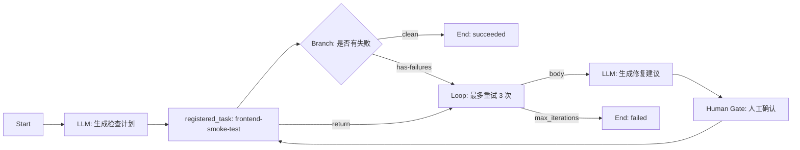

# Task Graph MVP 端到端验收记录

日期：2026-05-09  
关联 ticket：000038

## 验收范围

本次验收以 `frontend-smoke-loop` system graph 作为 MVP 样例，覆盖从内置目录、项目副本、编辑保存、运行态存储、解释器执行到前端 Run UI 的完整链路。

## 样例工作流



## 验收项

| 能力 | 验收方式 | 结果 |
| --- | --- | --- |
| System Graph catalog | `GET /api/projects/{project}/task-graphs` 与前端目录页 | 通过 |
| System Graph detail | `GET /api/projects/{project}/task-graphs/system/frontend-smoke-loop` 与画布预览 | 通过 |
| Fork to Project Graph | HTTP fork 测试与前端 Customize 入口 | 通过 |
| Project Graph create/patch/delete | HTTP CRUD 测试与 editor save fallback | 通过 |
| Validation errors | 非法 graph HTTP 测试返回 `validation_failed` | 通过 |
| Run snapshot | `POST /task-graph-runs` dry run 后读取 `graph_snapshot` | 通过 |
| Run list/detail/cancel | 新增 HTTP run API 验收测试覆盖 create/list/read/cancel | 通过 |
| Interpreter branch | `bb_core task_graph` 分支求值与分支执行测试 | 通过 |
| Interpreter loop | `bb_core task_graph` loop 条件、上限与退出测试 | 通过 |
| Human Gate pause/resume | `bb_core task_graph` human gate pause/reject 测试与前端暂停条 | 通过 |
| Run UI logs/artifacts | Browser smoke 验证失败节点 error、artifact、log tail 可读 | 通过 |

## 自测命令

```bash
cargo test -p bb_core task_graph
cargo test -p bb_cli tg_
npm run build --prefix bb_web
python3 scripts/check_ticket_ids.py --project blackboard
qmd embed
```

Browser smoke 使用 `http://127.0.0.1:8060/#/projects/blackboard/task-graphs`，在 `frontend-smoke-loop` 上启动 mock run，确认 Run UI 出现 `Branch Decisions`、`Loop Iterations`、Human Gate 暂停条、`frontend_smoke_failed`、`artifacts/smoke-task.json` 与 `Log Tail`。

## 结论

Task Graph MVP 已具备 Review 所需的端到端闭环：用户可以从 system graph 查看样例、fork 到 project graph、编辑 project graph、启动 run，并查看 branch/loop/human gate/log/artifact 运行态结果。
