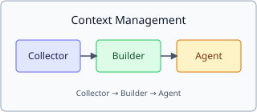

# 上下文管理模块

子模块级 wiki 示例，演示：

- 嵌套目录 `modules/context-management/`
- 子目录内 `index.md` 作为入口
- 相对图片 `./diagram.svg`
- 相对链接回父级 `../session.md`

## 设计图

## 相关文档

- [../session.md](../session.md) — 单文件模块示例
- [../../references/glossary.md](../../references/glossary.md) — 术语
- [../../index.md](../../index.md) — 回到 wiki 入口
