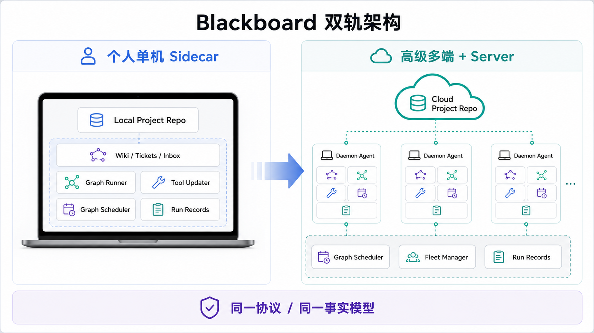

# Blackboard Cloud 双轨架构原型

## 产品判断

Blackboard 应保持同一套 project facts、graph runtime 和 daemon 协议，同时支持两种部署拓扑：

- 个人用户使用单机 sidecar：本地 client、本地 daemon、本地 project repo、本地 graph runner 和本地 AI 工具更新。
- 高级用户使用多 client + server：cloud project repo 成为协作事实源，多台 client daemon 注册为 worker，由 server 管理 graph run、tool channel、fleet 状态和 run records。

## 核心边界

- Fact Store：保存 wiki、tickets、inbox、graph definitions。local mode 使用本机落盘，server mode 使用 cloud/server API。
- Daemon Agent：每台电脑上的本地执行者，负责 workspace、AI tool、graph node、日志、artifact 和 handoff。
- Control Plane：管理 graph scheduler、fleet manager、tool updater、run records。local mode 可退化为本机队列，server mode 负责跨设备调度。
- Projection Layer：把事实源投影为现有 bb 文件、搜索索引和 web 视图。
- Identity Layer：提前保留 project id、device id、agent id、revision 和 lease，以便单机项目平滑升级到云端。

## 升级路径

个人用户无需一开始理解 server 部署；当用户需要第二台电脑、GPU 节点、工作室机器或远程常驻 daemon 时，可以把 local project 发布为 cloud project，再逐步 attach 更多 client daemon。
