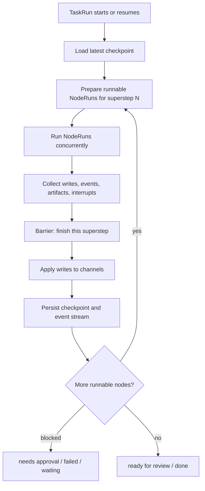
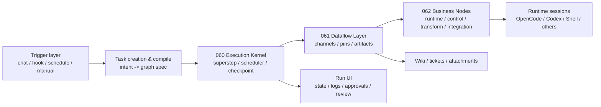

# Proposal: Superstep-based TaskGraph Agent Orchestration

> 本文基于 `C:\Dev\kb\projects\agentic\langgraphjs\modules` 对 LangGraphJS 的蒸馏，尤其是 `pregel`、`checkpoint`、`api`、`sdk`、`supervisor`、`swarm` 模块。结论不是照搬 LangGraph，而是把它的执行内核思想翻译成 Blackboard 的 project/ticket/worktree 多 Runtime 协作平台。

## Vision

用户只说几句话，TaskGraph 把任务拆成可恢复、可审计、可验收的多 Runtime 协作流；用户离开也能推进，回来只需要看结果、批权限、验收。

TaskGraph 的目标不是做另一个 ChatBot，也不是只给某个模型 API 套壳。它要成为 Blackboard 的任务执行平面：围绕一个 project、ticket、worktree，把 Codex、OpenCode、Claude、本地 Shell、测试器、Reviewers 和外部通知系统组织成一张可运行的协作图。

## What We Learn From LangGraph

LangGraph 的核心分层非常清楚：

- `StateGraph / Graph`：声明式构建层，负责把用户定义的节点和边编译成可执行图。
- `Pregel`：运行时执行层，用 superstep 推进图执行。
- `Channels`：节点间通信层，负责状态、消息、聚合和屏障。
- `Checkpointer`：持久化层，负责 thread/run 的恢复、时间旅行和 pending writes。
- `API / SDK`：远程执行协议层，提供 threads、runs、stream、cancel、state get/update。
- `Supervisor / Swarm`：多 Agent handoff 模式，给任务交接和控制权转移提供参考。

对 Blackboard 最重要的不是 API 形状，而是三条原则：

1. 图执行必须有回合边界。没有 superstep/barrier，就很难并发、恢复、审计和确定下一批任务。
2. 节点输出不能直接互相乱塞。需要 channel/data contract 作为中间层，输出先进入持久化、可校验的数据平面。
3. 长任务必须 checkpoint-first。事件流可以实时显示，但系统真相应先写入 run/checkpoint/artifact，再投递 UI/通知。

## Superstep Model For TaskGraph

Superstep 是图执行的一轮同步回合。每一轮做四件事：

1. 基于当前 checkpoint/channel 选择本轮可运行节点。
2. 并发执行这些节点，每个节点只产出 writes/events/artifacts。
3. 等本轮所有节点结束或进入中断，再把 writes 统一应用到 channel。
4. 写 checkpoint，生成下一轮 pending tasks。

对 SWE 场景，这个模型自然映射成：

- Round 1：前端设计、后端设计、风险调查并发。
- Round 2：汇总设计，建立 API/数据契约，做设计 review。
- Round 3：拆 tickets/work items，明确依赖和写入边界。
- Round 4..N-1：多 Runtime/Agent 并行实现、测试、修复。
- Round N：统一验证、review、handoff summary，交给用户验收。

## Blackboard-specific Runtime Semantics

TaskGraph 的 Node 不是 LangGraph 里的普通函数节点。Blackboard 的节点应绑定真实 Runtime 和权限：

- `RuntimeSession`：OpenCode/Codex/Claude/Shell/Test runner/Integration。
- `ProjectBinding`：project、ticket、worktree、repo、cwd。
- `PermissionPolicy`：read-only、write-scoped、run-tests、network、git-operation、external-notify。
- `ArtifactContract`：findings、proposal、diff、test_result、review_comments、handoff_summary。
- `ResumeContract`：session id、last checkpoint、pending writes、interrupt reason、replayable event log。

这决定了 TaskGraph 的核心对象不是“聊天消息”，而是：

- `TaskGraphSpec`：可编译的图定义。
- `TaskRun`：一次围绕 project/ticket/worktree 的执行实例。
- `SuperstepRun`：一轮同步执行记录。
- `NodeRun`：某个节点在某个 superstep 内的执行。
- `ChannelState`：节点之间传递的数据状态。
- `Artifact`：可审计、可引用、可验收的产物。
- `RuntimeSessionBinding`：NodeRun 与外部 agent/tool session 的绑定。

## Proposed Architecture

### 060: Superstep Execution Kernel

060 应定义 TaskGraph 的执行内核。它回答：一张图如何开始、暂停、恢复、并发、失败、重试、取消和进入下一轮。

核心范围：

- TaskRun/SuperstepRun/NodeRun 状态机。
- runnable node selection。
- superstep barrier。
- checkpoint-first persistence。
- event stream。
- interrupt/approval。
- retry/cancel/timeout。
- runtime session resume binding。

060 不负责定义所有数据类型，也不负责列出业务节点 taxonomy。

### 061: Dataflow, Channels And Artifacts

061 应定义 TaskGraph 的数据平面。它回答：节点之间如何传递信息，产物如何被持久化、引用、校验和展示。

核心范围：

- typed input/output pins。
- channel kinds：last_value、topic、aggregate、barrier、artifact_ref。
- channel version / versions_seen。
- artifact contract：kind、uri/ref、schema、producer_node_run、checksum/metadata。
- context scope：graph/run/node/runtime。
- validation error shape。

061 不负责调度节点，也不负责决定业务节点分类。

### 062: Node Taxonomy And Business Execution Layer

062 应定义可组合节点模型。它回答：TaskGraph 第一阶段有哪些节点，节点如何声明权限、输入、输出和 runtime binding。

核心范围：

- Control nodes：start/end/branch/join/human gate。
- Runtime nodes：Explorer/Implementer/Verifier/Reviewer/Shell/OpenCode/Codex。
- Transform nodes：summarize/extract/merge/schema-map。
- Artifact nodes：create/update ticket、write wiki、attach artifact、produce handoff。
- Integration nodes：Feishu/webhook/notification/Git。
- node spec schema、palette、inspector、run renderer。

062 依赖 060 的执行语义和 061 的数据契约。

## Minimal Vertical Slice

三张票虽然分层，但不能长期各做各的。第一阶段建议做一个最小垂直切片：

1. 一个 chat/manual trigger 创建 TaskRun。
2. 编译出固定模板：Explorer -> Implementer -> Verifier -> Handoff。
3. 060 能跑 superstep，并把 NodeRun/Event/Checkpoint 持久化。
4. 061 能传递最少数据：text、markdown、json、diff、test_result、artifact_ref。
5. 062 能绑定一个真实 runtime：先 OpenCode 或 Shell，再接 Codex。
6. UI 能看 run 状态、节点状态、日志、artifact、approval block。

这样可以避免先做一个巨大抽象但没有真实闭环。

## Persistence And Audit Requirements

每个 TaskRun 必须能回答：

- 这个任务由哪个 trigger 创建，绑定哪个 project/ticket/worktree。
- 每个 superstep 做了什么，哪些节点并发，谁写了什么 channel。
- 哪些 Runtime session 被创建、复用、恢复或失败。
- 哪些权限被授予，哪一步被用户批准。
- 产出了哪些 diff、test result、wiki、ticket update、handoff summary。
- 当前停在哪个 checkpoint，为什么停，怎么恢复。

这要求数据层至少包含：

- `task_runs`
- `superstep_runs`
- `node_runs`
- `run_events`
- `channel_states`
- `checkpoints`
- `artifacts`
- `runtime_session_bindings`

本地实现可以先用 JSON/SQLite，但接口语义要按可迁移存储设计。

## Open Questions

- 第一阶段 checkpoint 使用 JSON 文件还是 SQLite：JSON 更快落地，SQLite 更接近长任务并发和查询需求。
- Runtime session 是否由 TaskGraph 直接创建，还是调用现有 AgentSession API：建议复用 AgentSession，再加 TaskGraph binding。
- Channel version 需要做到多强：MVP 可用递增整数；后续支持 parent checkpoint/fork。
- Dynamic orchestration 何时引入：先不做 agent 动态生成图，先做 fixed-template compile + resumable execution。

## Recommendation

把 060/061/062 明确拆成三层，但按垂直切片联动交付：

- 060 是地基：superstep-based execution kernel。
- 061 是血管：dataflow/channel/artifact contract。
- 062 是手脚：业务节点、Runtime 绑定和 UI 可操作节点。

LangGraph 证明了 superstep + checkpoint + channel 是长期稳定路线。Blackboard 的差异化在于把这个模型落到多 Runtime 协作、ticket/worktree 权限、artifact 审计和用户离开后的自动推进上。
