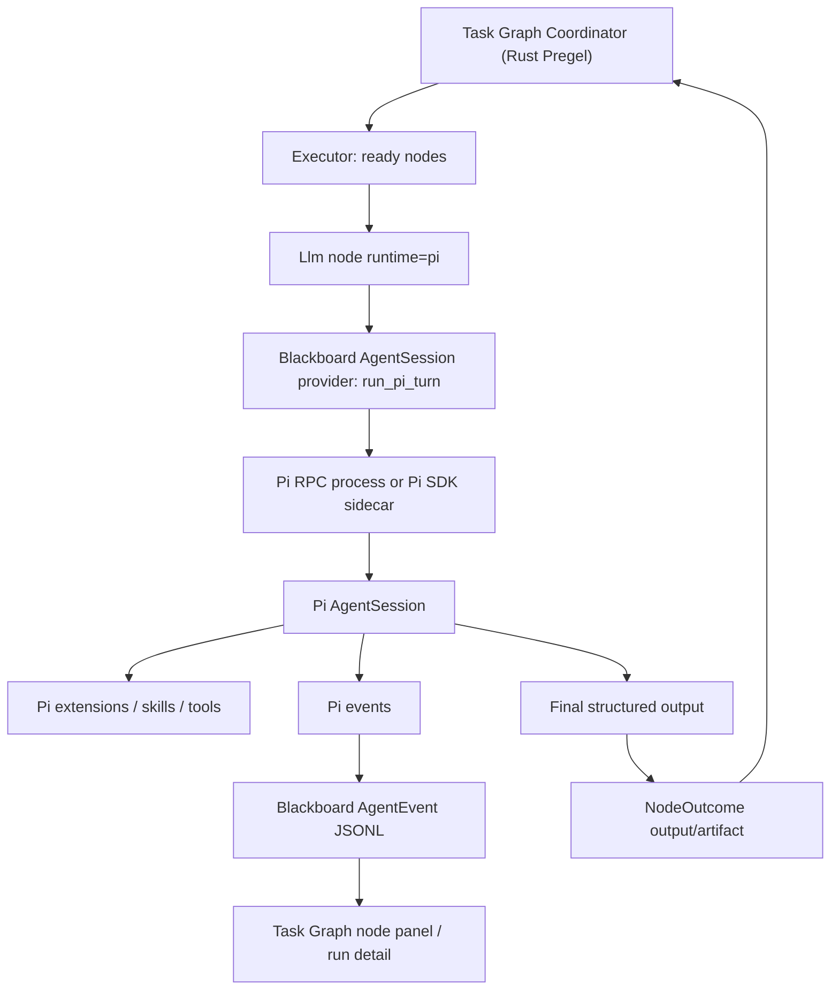

# Pi 与 Blackboard Task Graph 深度集成调研

调研日期：2026-05-21  
对象：<https://github.com/earendil-works/pi>  
关联文档：`.bb_template/wiki/research/2026-05-21-earendil-works-pi.md`  
本地 Pi 源码快照：`4868222e3414554987bf4b05fbb393fc65080aa0`

## Executive Finding

Pi 更适合深度集成到 Blackboard Task Graph 的 **agent runtime / node harness 层**，不适合替代 Blackboard 当前的 Pregel coordinator。

Blackboard Task Graph 已经有自己的核心执行语义：

- Pregel-style superstep 调度。
- channel / checkpoint / graph revision。
- `LlmCoordinator`、`LlmMutation`、`SubGraph`、`SchemaValidate`、`SystemWriteOutput` 等图级节点。
- 运行时拓扑变更通过 `GraphMutationOp` 和 coordinator 单写者归并。

Pi 提供的强项在另一层：

- 单 agent session 的生命周期和事件流。
- 多 provider 模型适配。
- tool execution 事件化。
- extension / skill / prompt / resource loader。
- RPC/SDK 嵌入方式。
- session tree、fork、compaction、steering/follow-up。

所以最优方向不是“让 Pi 管 task graph”，而是：

```text
Blackboard Pregel Coordinator 继续做图调度与状态归并
Pi 作为可插拔 AgentSession runtime 执行单个 LLM/Agent 节点
Pi events 映射为 Blackboard AgentSession events / node log / artifact
Pi extension 暴露 Blackboard-aware tools，但 mutation apply 仍回到 Task Graph deterministic 节点
```

更准确地说，`runtime = "pi"` 作为第四种 AgentSession provider 只是 L1。真正的深度集成点是把 Pi 的 `AgentHarness` 设计升格为 Blackboard 的 **AgentNode 微内核**，让一个 Task Graph node 内部拥有可扩展 tools/resources/session/fork/compaction/event lifecycle，同时仍由 Blackboard 的 Pregel coordinator 负责 graph-level scheduling、barrier、channel write 和 topology mutation。

## 深度集成判断

### 可以更深，而且最有价值的不是 provider

Pi 的深层价值不在“又能跑一个 CLI agent”，而在它把单个 agent run 里最难做好的东西抽成了 harness：

- turn snapshot：每个 turn 固定 model、tools、resources、system prompt、stream options。
- save point：assistant/tool result 完成后刷新下一轮上下文。
- extension hooks：`before_agent_start`、`context`、`tool_call`、`tool_result`、`before_provider_request`、`session_before_compact` 等。
- session tree：同一 session 文件内可 branch/fork/clone/navigate。
- custom resources：skills、prompt templates、context files、extensions。
- structured tools：工具有 TypeBox schema、streaming update、`terminate: true`。
- semi-durable harness 设计：队列、pending writes、operation/turn/tool boundaries 可作为 durable entries。

这些能力如果只包成 `run_pi_turn()` 会被浪费。更好的方向是让 Task Graph 的 LLM/Agent 节点变成：

```text
TaskGraph AgentNode
  = Pregel node shell
  + Pi AgentHarness instance
  + Blackboard resource bundle
  + Blackboard tool bridge
  + Blackboard output contract
```

### 深度集成层级

| 层级 | 形态 | 深度 | 建议 |
| --- | --- | --- | --- |
| L1 | `runtime="pi"` provider | 低 | 必做，但只是接入 |
| L2 | Pi AgentHarness 作为 Task Graph AgentNode 微内核 | 高 | 推荐核心方向 |
| L3 | Pi extension/package 作为 Task Graph 插件 ABI | 高 | 适合扩展节点能力 |
| L4 | Pi session tree 与 Task Graph fanout/fork/provenance 对齐 | 很高 | 适合 dynamic graph / scout 模式 |
| L5 | Pi durable harness entries 融入 Blackboard run_state | 很高 | 适合 crash recovery，但实现成本最高 |

## L1 替代 OpenCode 的生产价值

如果只做 `runtime = "pi"`，它确实首先就是 OpenCode 的替代。这个替代是否成立，不能用“Pi 功能更多”证明，而要看它作为 **headless Task Graph runtime** 是否更轻、更可控、更稳定。

结论：Pi 在 L1 上比 OpenCode 更适合作为 Blackboard Task Graph 的生产 runtime，原因不是模型能力，而是 **集成面更小、协议更清晰、供应链更可控、产品耦合更低**。

### 1. 集成面：Pi 是 headless protocol-first，OpenCode 是 product-first

Blackboard 当前调用 OpenCode 的方式是：

```text
opencode run --format json --dir <workspace> --dangerously-skip-permissions --title <run> <prompt>
```

这对 Task Graph 来说只需要一个 headless agent runner。但 OpenCode CLI 本身暴露的是完整产品面：

- TUI 默认入口。
- `serve` / `web` HTTP server。
- `attach` remote backend。
- `acp` server。
- `mcp` 管理。
- `plugin` 安装。
- `github` / `pr` workflow。
- `stats` / `export` / `import` / `db` / `upgrade` / `uninstall`。
- `share` / share URL import。

这些能力对独立用户很好，但对 Task Graph runtime 是额外变量：配置、网络、插件、server、session/database、升级路径都可能影响 headless run。

Pi 也有 TUI 和 extension，但它给集成者的一等入口是：

- `pi -p`：一次性 print。
- `pi --mode json`：JSON event stream。
- `pi --mode rpc`：stdin/stdout JSONL command/response/event protocol。
- `@earendil-works/pi-coding-agent` SDK：Node 进程内嵌。

对 Blackboard L1 来说，`--mode rpc` 是明显更干净的 runtime contract：send prompt、read events、abort、get state、compact、follow-up/steer 都是协议命令，而不是只能解析一个 CLI run 的 stdout。

### 2. 协议稳定性：Pi RPC 比 OpenCode run JSON 更适合长期适配

OpenCode `run --format json` 是“raw JSON events”，Blackboard 现在需要写 `opencode.rs` parser 去适配 event shape。这个 parser 已经把 OpenCode event 解成：

- `step_start`
- `text`
- `tool_use`
- `error`
- `step_finish`

问题在于：这更像 CLI 输出格式，不像 host integration protocol。它适合显示和简单 capture，但对 Task Graph 的长期控制面不足。

Pi RPC 明确区分：

- command response：`{"type":"response","command":"prompt","success":true}`
- async events：`agent_start`、`turn_start/end`、`message_update`、`tool_execution_start/update/end`、`queue_update`、`compaction_*`、`auto_retry_*`
- control commands：`abort`、`compact`、`get_state`、`get_messages`、`set_model`、`set_thinking_level`
- extension UI protocol：`extension_ui_request` / `extension_ui_response`

这意味着 L1 先用 RPC，就已经为 L2/L3 铺路；OpenCode 的 `run --format json` 更像终点，不像地基。

### 3. 供应链：Pi 更容易 pin 和审计，OpenCode 是大二进制产品包

本机和 npm 检查：

- Blackboard 当前把 OpenCode 锁到 `1.15.0`：`bb_backend/crates/bb_core/src/agent_tools.rs` 中 `OPENCODE_VERSION = "1.15.0"`，且版本不匹配会标记 `VersionMismatch`。
- 本机 `opencode --version` 为 `1.15.0`。
- npm 当前 `opencode-ai` latest 为 `1.15.6`，且 dist-tags 中有大量 snapshot/dev/beta/windows/fix 分支。
- `opencode-ai@1.15.0` 本体只是 wrapper，但 Windows x64 optional binary 包 `opencode-windows-x64@1.15.0` unpacked size 约 `160 MB`。
- Pi `@earendil-works/pi-coding-agent@0.75.4` unpacked size 约 `11.5 MB`；核心包是 TS/JS workspace 包，依赖可用 npm lock/shrinkwrap 审计。
- Pi 上游 README 明确有 supply-chain hardening：直接外部依赖精确 pin、`save-exact=true`、`min-release-age=2`、发布 CLI 带 `npm-shrinkwrap.json`、安装建议 `--ignore-scripts`。

这不表示 OpenCode 不能 pin；Blackboard 已经在 pin。差别是：

```text
OpenCode pin 住的是一个完整产品二进制。
Pi pin 住的是一组 JS library/CLI 包和 shrinkwrap，可拆、可审、可局部替换。
```

对生产 Task Graph runner，后者更接近我们想要的“可控运行时依赖”。

### 4. 产品耦合：OpenCode 的强产品能力是 Blackboard 的重叠能力

OpenCode 已经带：

- 自己的 session/export/import/stat。
- 自己的 web/server/attach。
- 自己的 plugin system。
- 自己的 MCP config 管理。
- 自己的 GitHub/PR workflow。
- 自己的 agent/subagent/product conventions。

Blackboard 也正好有：

- task graph run state。
- agent session events。
- web UI。
- MCP/Blackboard tools。
- project/ticket/wiki/inbox context。
- graph/node/plugin/workflow 表达。

所以 OpenCode 强的地方，在 Blackboard 里容易变成“双系统”：两个 session、两个 UI、两个 plugin 管理、两个工作流语义。Pi 的 philosophy 更适合 Blackboard：核心保持小，缺的功能通过 extension/skill/package 加，而这些 extension 可以被 Blackboard 管起来。

### 5. 输出契约：Pi 更容易做 structured final output

OpenCode L1 现在主要是 capture text，再 `try_parse_json_or_text()`。

Pi 可以用 extension 注册 `final_output` tool：

- TypeBox schema 来自 Task Graph node output schema。
- tool result `details` 就是 JSON。
- 返回 `terminate: true`，避免再跑一轮 assistant follow-up。
- Blackboard 从 `tool_execution_end` 中取结构化结果。

这对 Task Graph 的 schema_validate / channel write 很关键。它把“LLM 最后文本里藏 JSON”改成“agent 必须调用最终输出工具”。

### 6. 结论：Pi 的 L1 优势是 runner 可控性，不是绝对轻量

需要诚实地说：Pi 不是零包袱。它也带 TUI、extensions、skills、providers、sessions，Node 版本要求也偏新。但在 Blackboard L1 替代 OpenCode 时，它更优的点是：

- 可以只使用 `--mode rpc --no-session`，把 UI/session 产品面关掉。
- 可以用 SDK/sidecar 继续深入，而不是卡在 CLI stdout parser。
- 供应链是 npm 包 + shrinkwrap，便于精确 pin 和审计。
- extension 能被 Blackboard 设计成受控 tool surface，而不是让 runtime 自带 workflow 抢语义。
- structured output 能自然成为 Task Graph node contract。

因此我会把 L1 目标定义成：

```text
不是“让 Pi 代替 OpenCode 做所有事”
而是“用 Pi RPC/SDK 替换 OpenCode product runtime，
让 Blackboard 持有 UI、workflow、MCP、session、schema 和 graph 语义”
```

### L1 PoC 必须验证的指标

为了从判断变成生产证据，建议做同 prompt A/B：

| 指标 | OpenCode 当前 | Pi PoC 目标 |
| --- | --- | --- |
| 冷启动耗时 | 记录 `opencode run --format json` 从 spawn 到首个 text/tool event | Pi 不高于 OpenCode 1.5x，最好更低 |
| 进程/内存 | 并发 3/10 时记录峰值进程数和 RSS | 不高于 OpenCode |
| JSON event parser 破坏率 | 版本升级后 parser 是否要改 | Pi RPC event schema 更少破坏 |
| schema 输出成功率 | final text parse / SchemaValidate 失败率 | `final_output` tool 后显著下降 |
| cancel 响应 | run cancel 到子进程退出耗时 | RPC `abort` + kill 可控 |
| 配置隔离 | 是否读取用户全局插件/服务配置 | `--no-session` + controlled agentDir / no package auto-load |
| 并发稳定性 | 3 runtime concurrency 下 API/provider/runtime failure | 不低于 OpenCode |

只有这些指标跑过，才能说“生产上替换成立”。但从架构和供应链面看，Pi 值得先作为 L1 替代 PoC。

## L2：Pi AgentHarness 作为 AgentNode 微内核

Blackboard 当前的 Task Graph node 执行模型是：

```text
Coordinator 选出 ready nodes
Executor 执行 node
node 返回 NodeOutcome
Coordinator barrier 归并 writes / state / mutation
```

Pi 的 AgentHarness 可以嵌进 “Executor 执行 node” 这一格，而不是只作为外部进程输出文本。一个 `AgentNode` 可定义：

```json
{
  "type": "llm",
  "config": {
    "runtime": "pi",
    "harness": {
      "provider": "anthropic",
      "model": "claude-sonnet-4-5",
      "thinking": "high",
      "tools": ["read", "grep", "bb_read_channel", "bb_emit_artifact", "final_output"],
      "extensions": ["blackboard-taskgraph"],
      "resources": {
        "skills": ["code-research"],
        "context_bundle": "node_inputs+project_wiki+upstream_artifacts"
      },
      "session_resume_policy": "fork_from_previous"
    },
    "output_schema": {}
  }
}
```

语义边界：

- Pi harness 可以在 node 内多 turn、调用工具、compaction、retry、branch。
- Blackboard coordinator 不参与 node 内部 micro-turn 调度。
- node 对 graph 的可见输出只在完成时变成 `NodeOutcome`。
- streaming events 进入 node log / AgentSession events，但不提前写 channel。
- 如果 Pi 需要用户输入，转成 Task Graph paused/HumanGate。

这让 Task Graph 保持 Pregel 的确定性，同时让每个 agent node 有成熟 harness。

## L3：Pi extension/package 作为 Task Graph 插件 ABI

Pi package 天然可以携带：

- extensions
- skills
- prompt templates
- themes
- npm dependencies

Blackboard 可以把它转成 Task Graph 的插件包模型：

```text
Pi package
  ├─ extension: 注册 tools / hooks / provider
  ├─ skills: 作为节点可选技能
  ├─ prompts: 作为节点模板
  └─ manifest: 生成 Task Graph node palette entries
```

更进一步，Blackboard 可定义一个 `blackboard-taskgraph` Pi extension，提供 Graph-native 工具：

- `bb_read_inputs`：读取当前 node 输入和上游 artifacts。
- `bb_write_artifact`：写 node-scoped artifact。
- `bb_emit_progress`：写 Blackboard AgentEvent/NodeLog。
- `bb_request_human_gate`：请求 UI 审批，映射 run paused。
- `bb_propose_mutation`：输出 mutation proposal，但不直接 apply。
- `final_output`：提交符合 node output schema 的最终结果，并 `terminate: true`。

关键限制：

- extension 不能直接改 Task Graph JSON。
- extension 不能绕过 coordinator 写 channel。
- mutation 只能以 proposal/artifact 形式返回，由 `SchemaValidate` / `TopologyMutation` / coordinator apply。

这个边界可以避免 Pi extension 权限过大，同时把它变成 Task Graph 的能力插件。

## L4：Pi Session Tree 对齐 Task Graph Fanout/Fork

Pi session tree 最适合嵌到 Blackboard 的 dynamic fanout / scout 模式里。

当前 Task Graph 的 fanout 通常是：

```text
coordinator -> 多个 scout llm nodes -> synthesize node
```

深度集成后可以变成：

```text
parent Pi session leaf
  ├─ fork scout A session branch
  ├─ fork scout B session branch
  └─ fork scout C session branch
       ↓
TaskGraph scout nodes 并行执行
       ↓
synthesize node 读取 scout artifacts + session branch summaries
```

这带来三个好处：

1. **上下文继承更干净**：每个 scout 从同一个 planning/context leaf fork，不互相污染。
2. **可回放性更强**：每个节点不只是 artifact，还有完整 agent branch。
3. **动态图可解释**：`LlmCoordinator` 或 `LlmMutation` 生成新节点时，可以记录“这个节点来自哪个 Pi session entry/branch summary”。

推荐把 provenance 写入 node state：

```json
{
  "agent_session_id": "...",
  "session_leaf_id": "...",
  "forked_from_session_id": "...",
  "forked_from_entry_id": "...",
  "branch_summary_artifact": "..."
}
```

这比单纯保存 stdout/log 更接近 Task Graph 的 long-running research/workflow 需求。

## L5：Pi Durable Harness 思路进入 Blackboard run_state

Pi 的 `durable-harness.md` 设计指出：完整 provider stream 不现实，但可以把 session 作为 durable append-only state tree，并持久化：

- queue enqueued / consumed
- pending writes
- operation start/finish/interrupted
- turn start/finish
- provider request start/finish
- tool call start/finish

Blackboard Task Graph 可以吸收这个模型，升级当前 AgentSession events：

```text
TaskGraphRun
  ├─ superstep checkpoints
  ├─ node states
  ├─ agent session events
  └─ harness durable events
       ├─ operation_started
       ├─ turn_started
       ├─ provider_request_started
       ├─ tool_call_started
       ├─ tool_call_finished
       └─ operation_interrupted
```

这对 crash recovery 很关键：

- 如果 provider stream 中断，Blackboard 可标记 node interrupted，而不是只留下 failed log。
- 未完成 tool call 默认不能自动重试，除非 tool 声明 idempotent。
- retry 可以从 durable boundary 重启，而不是盲目重放整个 prompt。

这属于高成本后续路线，但方向上很适合 Task Graph。

## 不建议的“深度集成”

以下看似更深，但会破坏 Blackboard 的图优势：

- **把整个 Task Graph 编译成 Pi subagent workflow**：会隐藏节点、边、checkpoint、mutation，Web UI 只能看到一个大 agent。
- **让 Pi extension 直接写 graph 文件或 run_state**：会绕过 coordinator 单写者和 revision conflict。
- **把 Pi session leaf 当 Pregel checkpoint**：两者不是同一语义；session 是 conversation tree，checkpoint 是 graph/channel state。
- **让 Pi 内部 subagent fanout 替代 Task Graph fanout**：除非只是 node 内部临时探索；一旦 fanout 是产品可见流程，应由 Task Graph 表达。

## Blackboard 现状对齐

本地代码里已经有一个和 Pi 很接近的 runtime 抽象：

- `bb_backend/crates/bb_core/src/task_graph/nodes/runtime/llm_node.rs`
  - `runtime_uses_agent_session(runtime)` 当前匹配 `opencode | codex | codebuddy`。
  - 这些 runtime 会走 `execute_agent_session_node()`。
  - 节点状态会写 `agent_session_id` 和 `agent_session` summary。
- `bb_backend/crates/bb_core/src/agent_session/runtime.rs`
  - `run_turn()` 分发到 `run_opencode_turn`、`run_codex_turn`、`run_codebuddy_turn`。
  - Provider stdout JSON 被解析为 `AgentEventType::{Status, Text, Thinking, ToolUse, ToolResult, Error, Log, UsageUpdate}`。
- `bb_backend/crates/bb_core/src/task_graph/pregel/coordinator.rs`
  - Coordinator 是 graph 状态单写者。
  - Executor 只返回 `NodeOutcome`，长运行节点只允许写 streaming log / running projection。
- `bb_web/src/data/taskGraphs.ts`
  - 已经有 `TaskGraphRuntimeBindingKind = 'none' | 'llm' | 'agent_session' | 'shell' | 'sub_graph' | 'blackboard' | 'webhook'`。

这意味着 Pi 集成不需要重写 Task Graph，只要新增一种 AgentSession provider/runtime。

## 集成层级

### L0：Pi CLI 作为普通外部 runtime

最小接入方式：把 `pi` 当成 `opencode` 类似的 CLI runtime，Task Graph 节点 spawn：

```bash
pi --mode json --no-session "prompt..."
```

或：

```bash
pi -p "prompt..."
```

优点：

- 实现最快。
- 和现有 `run_runtime_command()` 模式相近。

缺点：

- 单轮为主，较难充分利用 Pi session tree / fork / steering。
- JSON/文本输出需要再写 parser。
- extension UI、tool lifecycle、session state 不够完整。

适合用来做 smoke PoC，不适合作为深度集成终态。

### L1：Pi RPC 作为 Blackboard AgentSession runtime

更合适的接入方式：新增 `runtime = "pi"`，在 `agent_session::run_turn()` 里实现 `run_pi_turn()`：

- spawn `pi --mode rpc`。
- 向 stdin 发送 `{"type":"prompt","message":...}`。
- 从 stdout 读取 JSONL events。
- 将 Pi events 映射到 Blackboard `AgentEvent`。
- `agent_end` 后提取最终 assistant text / structured output 作为 `parse_source` 和 artifact。

Pi RPC 关键能力：

- `message_update`：流式 text/thinking/toolcall delta。
- `tool_execution_start/update/end`：工具生命周期。
- `agent_start/end`、`turn_start/end`：agent 运行边界。
- `queue_update`：steering/follow-up。
- `compaction_start/end`、`auto_retry_start/end`。
- `extension_ui_request`：extension 在 RPC 模式下请求 host UI。

映射建议：

| Pi event | Blackboard event / state |
| --- | --- |
| `agent_start` | `AgentEventType::Status` |
| `message_update.text_delta` | `AgentEventType::Text` |
| `message_update.thinking_delta` | `AgentEventType::Thinking` |
| `tool_execution_start` | `AgentEventType::ToolUse` |
| `tool_execution_update` | `AgentEventType::Log` 或更新 ToolUse partial |
| `tool_execution_end` | `AgentEventType::ToolResult` |
| `auto_retry_start/end` | `AgentEventType::Status` / `Log` |
| `compaction_start/end` | `AgentEventType::Status` |
| `extension_ui_request` | 映射为 Task Graph paused / human gate，或在 headless 模式自动拒绝 |
| `agent_end` | 完成 session，生成 `AgentResult` |

这是推荐的第一阶段深度集成。

### L2：Pi SDK sidecar 作为长期 runtime

Rust backend 不能直接 import TypeScript SDK。若要更深入使用 Pi SDK，可以启动一个 Node sidecar：

```text
bb_backend Rust
  -> local HTTP/JSONL sidecar
      -> @earendil-works/pi-coding-agent SDK
          -> AgentSession / ResourceLoader / Extensions / ModelRegistry
```

优点：

- 比 CLI/RPC 更类型化。
- 可以直接创建 `AgentSession`，订阅事件，传入 custom tools/resource loader。
- 可以把 Blackboard project context、TaskGraph node config、allowed tools、skills 作为 SDK options 注入。

缺点：

- 多一个常驻进程和版本管理面。
- 需要设计 sidecar health、crash recovery、backpressure、timeout、log redaction。

适合第二阶段，尤其是当 Task Graph 需要复用 Pi extension ecosystem 或自定义 provider 时。

### L3：Pi Extension 暴露 Blackboard-aware tools

Pi extension 可以注册 LLM 工具、拦截 tool_call、修改 system prompt、处理 compaction、接 UI request。对 Task Graph 的价值在于给 Pi node 一个更强的 Blackboard-aware tool surface：

- `bb_read_task_graph_context`
- `bb_emit_node_artifact`
- `bb_request_graph_mutation_plan`
- `bb_search_project_wiki`
- `bb_append_runtime_note`

但有一个关键边界：

**Pi extension 不应该直接成为 graph mutation 的权威写入者。**

推荐模式：

```text
Pi agent node
  -> 输出 GraphMutationPlan / JSON artifact
SchemaValidate node
  -> 校验 JSON schema、节点/edge/pin 合法性
TopologyMutation / LlmMutation node
  -> 由 Blackboard coordinator 在 barrier 后应用 mutation
```

这样 Pi 能帮忙“想”和“生成”，但 Blackboard 仍保持 deterministic apply、revision conflict、checkpoint migration。

## 为什么不能用 Pi 替代 Pregel Coordinator

Pi session tree 与 Blackboard Task Graph 的 checkpoint 不是同一个抽象。

Pi session tree 解决的是：

- 会话历史分叉。
- prompt/response/tool result 可回放。
- compaction 和上下文连续性。

Blackboard Pregel coordinator 解决的是：

- 多节点 superstep 调度。
- channel version / versions_seen。
- barrier 写入归并。
- 子图、循环、人机 gate、拓扑 mutation。
- run_state 持久化和 UI 可观测。

如果让 Pi 负责调度整个 Task Graph，会丢掉 Blackboard 当前最重要的产品差异：可视化图、确定性 checkpoint、runtime topology mutation 和 run-level observability。

## 最有价值的设计迁移

### 1. AgentSession 事件模型升级

Blackboard 已经有 `AgentEventType`，但 Pi 的事件粒度更细。可以补充：

- tool call args partial / final。
- assistant content block index。
- turn index。
- compaction event。
- retry event。
- queue event。

这会让 Task Graph node 面板不仅能看到日志尾部，还能看到“模型在想什么、调用了什么工具、工具结果是什么、是否自动重试/压缩过”。

### 2. Node-level session resume policy

Pi 支持 session resume/fork/clone。Blackboard 前端类型里已出现 `TaskGraphSessionResumePolicy`：

- `none`
- `reuse_by_run`
- `reuse_by_node`
- `fork_from_previous`

这可以和 Pi session tree 对齐：

- `reuse_by_run`：同一个 run 的多个 Pi 节点共享一个 session，适合连续研究/写作流水线。
- `reuse_by_node`：同一个 node retry/resume 复用 session，适合长 agent node。
- `fork_from_previous`：从上游 node 的 session leaf fork，适合 scout/fanout，每个 scout 分叉独立探索。

这是 Pi 与 Task Graph 最值得深入结合的点之一。

### 3. Graph input/context 变成 Pi ResourceLoader

Pi 的 `ResourceLoader` 可加载 context files、skills、prompts、extensions。Task Graph 可以把节点上下文映射为 Pi resources：

- graph input -> prompt template vars。
- project wiki slice -> virtual context file。
- node skills -> Pi skills。
- task graph runtime policy -> Pi extension / system prompt fragment。

这样每个 node 不是拼一个巨大的 prompt，而是得到一个结构化 resource bundle。

### 4. Structured output 作为节点契约

Pi example 里有 `structured-output` extension，工具可以返回 `terminate: true`，让 agent 以结构化结果结束。Task Graph 可以定义一个内置 Pi extension：

- 注册 `final_output` 工具。
- schema 来自 node output spec 或后续 JSON Schema。
- tool result 带 `terminate: true`。
- Blackboard 只接受 `final_output` 的 JSON 作为 node output。

这样比“从最终文本里猜 JSON”更稳。

### 5. Extension UI 映射 HumanGate

Pi RPC 的 `extension_ui_request` 可以映射到 Blackboard Task Graph 的 paused state：

- `confirm` -> HumanGate action。
- `select` -> HumanGate actions。
- `editor/input` -> HumanGate form。
- timeout -> 默认 reject/cancel 或按 node policy 处理。

这能让 Pi extension 中的 permission gate / question tool 进入 Blackboard 的可视化审批流，而不是卡死 headless runner。

## 推荐架构



## MVP 实施建议

### Step 1：新增 `runtime = "pi"` AgentSession provider

改动范围：

- `bb_backend/crates/bb_core/src/agent_session/providers/pi.rs`
- `bb_backend/crates/bb_core/src/agent_session/runtime.rs`
- `bb_backend/crates/bb_core/src/task_graph/nodes/runtime/llm_node.rs`
- `bb_backend/crates/bb_cli/src/http/agent_sessions.rs`（如需 HTTP 创建 session 支持 runtime=pi）
- runner config 增加 `pi_command = "pi"`

验收标准：

- Task Graph LLM node 配置 `runtime: "pi"` 可以跑通。
- node state 有 `agent_session_id`。
- Pi text/thinking/tool events 可在 Blackboard agent session events 里看到。
- 最终输出可写 artifact 并进入 downstream channel。

### Step 2：Pi structured-output extension

新增一个 Blackboard-managed Pi extension：

- 启动 Pi 时通过 `-e` 或 project `.pi/extensions` 注入。
- 根据 node output schema 注册 `final_output` tool。
- agent 调用 `final_output` 后终止 turn。
- Blackboard 从 `tool_execution_end` result 中取 JSON，失败则 node failed。

验收标准：

- 不再依赖 `try_parse_json_or_text()` 猜测最终文本。
- SchemaValidate 失败能明确定位到字段。

### Step 3：Session resume/fork policy

把 `TaskGraphSessionResumePolicy` 接到 Pi：

- `reuse_by_node`：retry 使用同一 Pi session 或 provider session。
- `fork_from_previous`：fanout scout 从 coordinator/session leaf fork。
- child session path/id 写入 node state。

验收标准：

- scout/fanout 节点有独立 session artifact。
- UI 可从 node 打开 session tree / fork lineage。

### Step 4：extension UI -> HumanGate

将 Pi RPC `extension_ui_request` 转为 Blackboard run paused：

- `confirm/select/editor/input` 生成 paused metadata。
- 用户在 Task Graph UI 选择/编辑后，runner 向 Pi RPC 回写 `extension_ui_response`。

注意：这需要长生命周期 Pi process；如果一轮 prompt 期间进程退出，就无法恢复 dialog。因此这一步更适合 SDK sidecar 或持久 RPC worker，而不是短命 CLI。

## 风险

- **进程生命周期**：短命 `pi --mode rpc` 无法很好处理 HumanGate 暂停/恢复；深度集成需要持久 worker 或 sidecar。
- **安全边界**：Pi extension 执行任意 TypeScript。Blackboard 若允许 project 安装 Pi package，必须有安装确认、版本 pin、禁用 lifecycle scripts、权限声明和审计。
- **双重状态源**：Pi session 和 Blackboard run_state 都保存过程。权威规则应明确：Task Graph checkpoint/run_state 是执行事实，Pi session 是 node artifact/trace。
- **输出契约**：若继续解析最终文本，稳定性不足。必须尽快引入 structured final output。
- **UI 阻塞**：Pi extension UI 在 headless runner 中必须转为 HumanGate 或自动拒绝，不能无期限等待。

## 结论

Pi 能让 Blackboard Task Graph 的 agent node 变得更强，但它应该作为 **AgentSession runtime adapter + extension/tool ecosystem** 集成，而不是作为图引擎集成。

推荐路线：

1. 先做 `runtime = "pi"` 的 RPC provider，让 Pi 成为 Task Graph LLM node 的一等 runtime。
2. 再做 Blackboard-managed Pi extension，提供 structured output 和 Blackboard-aware tools。
3. 最后做 SDK sidecar，支持持久 session、HumanGate UI bridge、session fork/resume policy。

这样能保留 Blackboard 的 Pregel / mutation / checkpoint 优势，同时吸收 Pi 在 agent harness 层的成熟设计。

## Source Evidence

- Blackboard task graph 调研：`.bb_template/078-taskgraph-research-fanout.md`
- Blackboard TaskGraph coordinator：`bb_backend/crates/bb_core/src/task_graph/pregel/coordinator.rs`
- Blackboard LLM runtime node：`bb_backend/crates/bb_core/src/task_graph/nodes/runtime/llm_node.rs`
- Blackboard AgentSession runtime：`bb_backend/crates/bb_core/src/agent_session/runtime.rs`
- Blackboard AgentSession model：`bb_backend/crates/bb_core/src/agent_session/model.rs`
- Pi RPC docs：`packages/coding-agent/docs/rpc.md` in local Pi clone
- Pi SDK docs：`packages/coding-agent/docs/sdk.md` in local Pi clone
- Pi extension docs：`packages/coding-agent/docs/extensions.md` in local Pi clone
